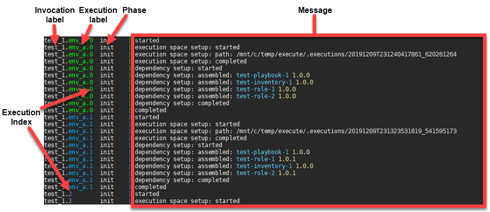
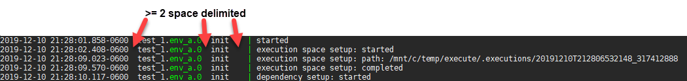

# Ansible Playbook: Execute

[](https://travis-ci.com/theque5t/ansible-playbook-execute)

Ansible playbook that:

- Takes in supplied playbook **executions as code**
- **Assembles dependencies** described in those executions, and in the dependencies themselves
- Runs those playbook executions **asynchronously**
- With **minimal output**

## Quick Start

1. Create execution(s)
   ```yaml
   echo '
   executions:
     - label: env_a
       playbooks:
         - playbook.yml
       inventory:
         - inventory
       environment:
         ANSIBLE_STDOUT_CALLBACK: default
       extra_vars:
         - target_inventory: int,&node.1
       dependencies:
         - name: test-playbook-1
           type: ansible_playbook
           src:
             repo: https://github.com/theque5t/ansible-playbook-test-playbook-1.git
             version: v1.0.0
           src_type: git_repo
           version: 1.0.0
   ' > executions.yml
   ```
2. Execute
   ```sh
   ansible-playbook -i controller.yml -e "@executions.yml" execute.yml
   ```
   

[TOC]

## Design Principles
- Built in Ansible to allow use of pre-existing knowledge users and contributors will likely have, and to consolidate controller dependencies
- Playbook executions in code
- Dependency management
- Asynchronous executions

## Components

### Callback Plugin: `diy.py`
Renders custom callback templates to output

### Configuration: `ansible.cfg`
Sets `diy` as stdout callback and provides default config for the `diy` callback

### Inventory: `controller.yml`
Describes the controller inventory

### Playbook: `execute.yml`
Includes the `execution_manager` role on the controller inventory

### Role: `execution_manager`
Takes in described executions, and for each execution it will go through 3 phases:
 * `init` The first of the 3 phases. In this phase, the following happens for each execution:
     1. Creates a unique execution space
     2. Includes the `dependency_manager` role
 * `output` Once all the executions have gone through the `init` phase, the output phase will do the following:
     1. Executes each execution asynchronously
     2. Returns output from each execution until all executions are finished
 * `result` Once all the executions have finished, the result of each execution will be output in this phase

### Role: `dependency_manager`
Goes through 3 phases to assemble dependencies described in executions, and in the dependencies themselves:
 * `collect` The first of the 3 phases. In this phase, the following happens recursively until all dependencies have been collected:
     1. Finds dependencies that have been described in a file(s), and/or passed in via argument
     2. Gets the dependencies using their described source
 * `filter` Once all the dependencies have been collected, dependencies are filtered to ensure there are no conflicts
 * `assemble` After the dependencies have been filtered, they are assembled into the applicable path

### Playbook: `kill.yml`
Kills inflight executions

## Installation

TODO  

## Usage

### Playbook Variables

* **Playbook:** <a id='execute-playbook' class='anchor'>`execute.yml`</a>
  **Purpose:** Used to execute executions
  **Playbook Variables:** None.
  **Role Variables:**
    * **Role:** execution_manager
      * `execution_manager_executions`
        * **Alias:** executions
        * **Required:** True
        * **Comments:** Used to specify the executions that should be executed. Each execution must comply with the [execution schema](#execution-schema).
        * **Type:** List
        * **Examples:**
          * Extra variables json:
            ```sh
            ansible-playbook -i controller.yml -e "{ executions: { label: env_a, ... } }" execute.yml
            ```
          * Extra variables file:
            **executions.yml:**
            ```yaml
            executions:
              - label: env_a
                ...
            ```
            **Command:**
            ```sh
            ansible-playbook -i controller.yml -e "@executions.yml" execute.yml
            ```
        * **Default:** None.
      * `execution_manager_invocation_label`
        * **Alias:** invocation_label
        * **Required:** False
        * **Comments:** Used to specify a label for the invocation. All executions will be linked to the invocation label. This is especially useful when looking to use [kill.yml](#kill-playbook) playbook against all executions.
        * **Type:** String
        * **Examples:**
          * Extra variables json:
            ```sh
            ansible-playbook -i controller.yml -e "@executions.yml" -e "{ invocation_label: deploy_1 }" execute.yml
            ```
          * Extra variables file:
            **executions.yml:**
            ```yaml
            invocation_label: deploy_1
            executions:
              - label: env_a
                ...
            ```
            **Command:**
            ```sh
            ansible-playbook -i controller.yml -e "@executions.yml" execute.yml
            ```
        * **Default:** Random number between 0 and 1000000
      * `execution_manager_output_timestamps`
        * **Alias:** output_timestamps
        * **Required:** False
        * **Comments:** Used to enable/disable timestamps in output. This is especially useful when looking to produce a log from the output.
        * **Type:** Boolean
        * **Choices:**
          * `true`: Enable timestamps
          * `false`: Disable timestamps
        * **Examples:**
          * Extra variables json:
            ```sh
            ansible-playbook -i controller.yml -e "@executions.yml" -e "{ invocation_label: deploy_1, output_timestamps: true }" execute.yml
            ```
          * Extra variables file:
            **executions.yml:**
            ```yaml
            invocation_label: deploy_1
            output_timestamps: true
            executions:
              - label: env_a
                ...
            ```
            **Command:**
            ```sh
            ansible-playbook -i controller.yml -e "@executions.yml" execute.yml
            ```
        * **Default:** False
      * `execution_manager_output_refresh_frequency`
        * **Alias:** output_refresh_frequency
        * **Required:** False
        * **Comments:** Used to specify the time frequency(seconds) in which output should be collected from the executions.
        * **Type:** Integer
        * **Examples:**
          * Extra variables json:
            ```sh
            ansible-playbook -i controller.yml -e "@executions.yml" -e "{ invocation_label: deploy_1, output_timestamps: true, output_refresh_frequency: 1 }" execute.yml
            ```
          * Extra variables file:
            **executions.yml:**
            ```yaml
            invocation_label: deploy_1
            output_timestamps: true
            output_refresh_frequency: 1
            executions:
              - label: env_a
                ...
            ```
            **Command:**
            ```sh
            ansible-playbook -i controller.yml -e "@executions.yml" execute.yml
            ```
        * **Default:** 5
      * `execution_manager_executions_directory`
        * **Alias:** executions_directory
        * **Required:** False
        * **Comments:** Used to specify the directory in which execution spaces will be generated.
        * **Type:** String
        * **Examples:**
          * Extra variables json:
            ```sh
            ansible-playbook -i controller.yml -e "@executions.yml" -e "{ invocation_label: deploy_1, output_timestamps: true, output_refresh_frequency: 1, executions_directory: ~/executions }" execute.yml
            ```
          * Extra variables file:
            **executions.yml:**
            ```yaml
            invocation_label: deploy_1
            output_timestamps: true
            output_refresh_frequency: 1
            executions_directory: ~/executions
            executions:
              - label: env_a
                ...
            ```
            **Command:**
            ```sh
            ansible-playbook -i controller.yml -e "@executions.yml" execute.yml
            ```
        * **Default:** .executions
    * **Role:** dependency_manager
      * `dependency_manager_cleanup`
        * **Alias:** cleanup
        * **Required:** False
        * **Comments:** Used to enable/disable cleanup tasks. Cleanup removes the role's working directory. This is especially useful when debugging.
        * **Type:** Boolean
        * **Choices:**
          * `true`: Enable cleanup
          * `false`: Disable cleanup
        * **Examples:**
          * Extra variables json:
            ```sh
            ansible-playbook -i controller.yml -e "@executions.yml" -e "{ invocation_label: debug_1, output_timestamps: true, cleanup: false }" execute.yml
            ```
          * Extra variables file:
            **executions.yml:**
            ```yaml
            invocation_label: debug_1
            output_timestamps: true
            cleanup: false
            executions:
              - label: env_a
                ...
            ```
            **Command:**
            ```sh
            ansible-playbook -i controller.yml -e "@executions.yml" execute.yml
            ```
        * **Default:** True
      * `dependency_manager_dependencies_file_name`
        * **Alias:** dependencies_file_name
        * **Required:** False
        * **Comments:** Used to specify the YAML file name in which dependencies can be found. The file extension should **not** be provided.
        * **Type:** String
        * **Examples:**
          * Extra variables json:
            ```sh
            ansible-playbook -i controller.yml -e "@executions.yml" -e "{ invocation_label: deploy_1, output_timestamps: true, output_refresh_frequency: 1, executions_directory: ~/executions, dependencies_file_name: requirements }" execute.yml
            ```
          * Extra variables file:
            **executions.yml:**
            ```yaml
            invocation_label: deploy_1
            output_timestamps: true
            output_refresh_frequency: 1
            executions_directory: ~/executions
            dependencies_file_name: requirements
            executions:
              - label: env_a
                ...
            ```
            **Command:**
            ```sh
            ansible-playbook -i controller.yml -e "@executions.yml" execute.yml
            ```
        * **Default:** dependencies
  
  **Plugin Variables:**
    * **Plugin:** diy
      * `ansible_callback_diy_all_default`
        * **Alias:** None.
        * **Required:** False
        * **Comments:** Used to set the default callback template for all callbacks. This is especially useful when debugging.
        * **Type:** String
        * **Examples:**
          * Enable the `default` callback plugin output:
            **executions.yml:**
            ```yaml
            invocation_label: debug_1
            output_timestamps: true
            cleanup: false
            ansible_callback_diy_all_default: '{{ omit }}'
            executions:
              - label: env_a
                ...
            ```
            **Command:**
            ```sh
            ansible-playbook -i controller.yml -e "@executions.yml" execute.yml
            ```
        * **Default:** None.

* **Playbook:** <a id='kill-playbook' class='anchor'>`kill.yml`</a>
  **Purpose:** Used to kill executions
  **Playbook Variables:**
    * `kill_filter`
      * **Alias:** filter
      * **Required:** True
      * **Comments:** Used to specify the executions that should be killed.
      * **Type:** String
      * **Examples:**
        * Kill all executions associated to invocation_label deploy_1:
          ```sh
          ansible-playbook -i controller.yml -e "{ filter: deploy_1 }" kill.yml
          ```
        * Kill all executions associated to invocation_label deploy_1 and have the label env_a
          ```sh
          ansible-playbook -i controller.yml -e "{ filter: deploy_1.env_a }" kill.yml
          ```
        * Kill execution associated to invocation_label deploy_1 and is at index 1 of the executions list
          ```sh
          ansible-playbook -i controller.yml -e "{ filter: deploy_1.1 }" kill.yml
          ```
      * **Default:** None.

  **Role Variables:** None.
  **Plugin Variables:** None.
    * **Plugin:** diy
      * `ansible_callback_diy_all_default`
        * **Alias:** None.
        * **Required:** False
        * **Comments:** Used to set the default callback template for all callbacks. This is especially useful when debugging.
        * **Type:** String
        * **Examples:**
          * Enable default plugin output:
            ```sh
            ansible-playbook -i controller.yml -e "{ filter: deploy_1.1, ansible_callback_diy_all_default: '{{ omit }}' }" kill.yml
            ```
        * **Default:** None.

### Examples

#### Execute described executions
1. Describe the execution(s) in the `executions` variable: 
   **executions.yml:**
   ```yaml
   executions:
     - label: env_a
       playbooks:
         - playbook.yml
       inventory:
         - inventory
       environment:
         ANSIBLE_STDOUT_CALLBACK: default
       extra_vars:
         - target_inventory: int,&node.1
       dependencies:
         - name: test-playbook-1
           type: ansible_playbook
           src:
             repo: https://github.com/theque5t/ansible-playbook-test-playbook-1.git
             version: v1.0.0
           src_type: git_repo
           version: 1.0.0
           
     - label: env_a
       playbooks:
         - playbook.yml
       inventory:
         - inventory
       environment:
         ANSIBLE_STDOUT_CALLBACK: unixy
       extra_vars:
         - target_inventory: int,&node.2
       dependencies:
         - name: test-playbook-1
           type: ansible_playbook
           src:
             repo: https://github.com/theque5t/ansible-playbook-test-playbook-1.git
             version: v1.0.0
           src_type: git_repo
           version: 1.0.0

         - name: test-role-1
           type: ansible_role
           src:
             repo: https://github.com/theque5t/ansible-role-test-role-1.git
             version: v1.0.1
           src_type: git_repo
           version: 1.0.1

     - playbooks:
         - playbook.yml
         - finale.yml
       inventory:
         - inventory.sh 
       environment:
         ANSIBLE_STDOUT_CALLBACK: oneline
       extra_vars:
         - pause: true
           pause_seconds: 3
       dependencies:
         - name: test-playbook-2
           type: ansible_playbook
           src:
             repo: https://github.com/theque5t/ansible-playbook-test-playbook-2.git
             version: v1.0.4
           src_type: git_repo
           version: 1.0.4
   ```
2. Run the `execute.yml` playbook 
   **Command:**
   ```sh
   ansible-playbook -i controller.yml -e "@executions.yml" -e "{ invocation_label: test_1 }" execute.yml
   ```
   

#### Kill executions
1. Run the `kill.yml` playbook
   **Command:**
   ```sh
   ansible-playbook -i controller.yml -e "{ filter: test_1 }" kill.yml
   ```

### Execution Schema

The `execution_manager` role asserts that each execution follows this schema:
```yaml
executions:                           # executions to be executed
  - name: <execution name>            # execution name
    playbooks:                        # playbook(s) to execute
      - <path>                        #   - playbook.yml
      - ...                           #   - path/to/playbook.yml 
    inventory:                        # inventory path(s), script(s), plugin(s)
      - <path>                        #   - path/to/inventory
      - <inventory script>            #   - inventory.sh
      - <inventory plugin>            #   - inventory_plugin.yml
      - ...                           #
    environment:                      # environment variable(s)
      <name1>: <value>                #   ANSIBLE_CONFIG: ansible.cfg
      <name2>: <value>                #   THIS: is an example
      ...                             #
    extra_vars:                       # extra variable(s)
      - <name1>: <value>              #   - something: cool
        <name2>: <value>              #     something_else: cool
      - "name=value"                  #   - "something_else_else=cool"
      - <@path>                       #   - "@path/to/extra_vars.yml"
      - ...                           #
    dependencies:                     # See Dependency Schema
      - ...                           # 
    # ask_vault_pass: <bool>          # Not available. TODO
    check: <bool>                     # See https://docs.ansible.com/ansible/latest/cli/ansible-playbook.html#cmdoption-ansible-playbook-c
    diff: <bool>                      # See https://docs.ansible.com/ansible/latest/cli/ansible-playbook.html#cmdoption-ansible-playbook-d
    flush_cache: <bool>               # See https://docs.ansible.com/ansible/latest/cli/ansible-playbook.html#cmdoption-ansible-playbook-flush-cache
    force_handlers: <bool>            # See https://docs.ansible.com/ansible/latest/cli/ansible-playbook.html#cmdoption-ansible-playbook-force-handlers
    forks: <int>                      # See https://docs.ansible.com/ansible/latest/cli/ansible-playbook.html#cmdoption-ansible-playbook-f
    limit: <subset>                   # See https://docs.ansible.com/ansible/latest/cli/ansible-playbook.html#cmdoption-ansible-playbook-l
    list_hosts: <bool>                # See https://docs.ansible.com/ansible/latest/cli/ansible-playbook.html#cmdoption-ansible-playbook-list-hosts
    list_tags: <bool>                 # See https://docs.ansible.com/ansible/latest/cli/ansible-playbook.html#cmdoption-ansible-playbook-list-tags
    list_tasks: <bool>                # See https://docs.ansible.com/ansible/latest/cli/ansible-playbook.html#cmdoption-ansible-playbook-list-tasks
    module_path:                      # Module path(s)
      - <path>                        #   - ~/library
      - ...                           #   - /usr/share/library
    skip_tags:                        # See https://docs.ansible.com/ansible/latest/cli/ansible-playbook.html#cmdoption-ansible-playbook-skip-tags
      - <tag>                         #   - some_tag
      - ...                           #   - some_other_tag
    start_at_task: <task_name>        # See https://docs.ansible.com/ansible/latest/cli/ansible-playbook.html#cmdoption-ansible-playbook-start-at-task
    # step: <bool>                    # Not available. TODO
    syntax_check: <bool>              # See https://docs.ansible.com/ansible/latest/cli/ansible-playbook.html#cmdoption-ansible-playbook-syntax-check
    tags:                             # See https://docs.ansible.com/ansible/latest/cli/ansible-playbook.html#cmdoption-ansible-playbook-tags
      - <tag>                         #   - another_tag
      - ...                           #   - last_tag
    vault_id: <vault_identity>        # See https://docs.ansible.com/ansible/latest/cli/ansible-playbook.html#cmdoption-ansible-playbook-vault-id
    vault_password_file: <path>       # See https://docs.ansible.com/ansible/latest/cli/ansible-playbook.html#cmdoption-ansible-playbook-vault-password-file
    verbose: <int>                    # Verbosity level
    # ask_pass: <bool>                # Not available. TODO
    private_key: <path>               # See https://docs.ansible.com/ansible/latest/cli/ansible-playbook.html#cmdoption-ansible-playbook-private-key
    user: <remote_user>               # See https://docs.ansible.com/ansible/latest/cli/ansible-playbook.html#cmdoption-ansible-playbook-u
    connection: <connection>          # See https://docs.ansible.com/ansible/latest/cli/ansible-playbook.html#cmdoption-ansible-playbook-connection
    timeout: <int>                    # See https://docs.ansible.com/ansible/latest/cli/ansible-playbook.html#cmdoption-ansible-playbook-t
    ssh_common_args: <args>           # See https://docs.ansible.com/ansible/latest/cli/ansible-playbook.html#cmdoption-ansible-playbook-ssh-common-args
    sftp_extra_args: <args>           # See https://docs.ansible.com/ansible/latest/cli/ansible-playbook.html#cmdoption-ansible-playbook-sftp-extra-args
    scp_extra_args: <args>            # See https://docs.ansible.com/ansible/latest/cli/ansible-playbook.html#cmdoption-ansible-playbook-scp-extra-args
    ssh_extra_args: <args>            # See https://docs.ansible.com/ansible/latest/cli/ansible-playbook.html#cmdoption-ansible-playbook-ssh-extra-args
    become: <bool>                    # See https://docs.ansible.com/ansible/latest/cli/ansible-playbook.html#cmdoption-ansible-playbook-b
    become_method: <become_method>    # See https://docs.ansible.com/ansible/latest/cli/ansible-playbook.html#cmdoption-ansible-playbook-become-method
    become_user: <become user>        # See https://docs.ansible.com/ansible/latest/cli/ansible-playbook.html#cmdoption-ansible-playbook-become-user
    # ask_become_pass: <bool>         # Not available. TODO
  - ...
```

### Dependency Schema

The `dependency_manager` role asserts that each dependency follows this schema:
```yaml
dependencies:                     # dependencies to be processed
  - name: <dependency_name>       # dependency name: test-playbook-1
    type: <dependency_type>       # See Dependency Types 
    src: <src>                    # See Source Types
    src_type: <src_type>          # See Source Types
    version: <strict_version>     # dependency version: 1.0.1
    include:                      # regex patterns that match files that should be included when assembled
      - <regex>                   #   - '.*\.y(a|)ml$'
      - ...                       #   - '.*\.(ini|cfg)$'
    exclude:                      # regex patterns that match files that should be exclude when assembled(takes precedence over include)
      - <regex>                   #   - '^.*\.git.*'
      - ...                       #   - '.*\.md$'
  - ...
```

### Dependency Types

* **Type:** `ansible_playbook`
  **Description:** [Ansible playbook](https://docs.ansible.com/ansible/latest/user_guide/playbooks_best_practices.html#content-organization) data
  **Assembly Path:** `<playbook_directory>`
  **Default Include:**
    * [default include file types](#default-include-file-types)
    * `^group_vars`
    * `^host_vars`
    * `^inventor(y|ies)`
    * `^library`
    * `^module_utils`
    * `^.*_plugins`
    * `^playbook(s|)`
    * `^roles`
    
  **Default Exclude:**
    * [default exclude file types](#default-exclude-file-types)

* **Type:** `ansible_inventory`
  **Description:** [Ansible inventory](https://docs.ansible.com/ansible/latest/user_guide/intro_inventory.html) data
  **Assembly Path:** `<playbook_directory>/inventory`
  **Default Include:**
    * [default include file types](#default-include-file-types)
    * `^group_vars`
    * `^host_vars`
    * `^[^.]+$`

  **Default Exclude:**
    * [default exclude file types](#default-exclude-file-types)
  
* **Type:** `ansible_role`
  **Description:** [Ansible role](https://docs.ansible.com/ansible/latest/user_guide/intro_inventory.html) data
  **Assembly Path:** `<playbook_directory>/roles/<dependency_name>`
  **Default Include:**
    * [default include file types](#default-include-file-types)
    * `^tasks`
    * `^handlers`
    * `^templates`
    * `^files`
    * `^vars`
    * `^defaults`
    * `^library`
    * `^module_utils`
    * `^.*_plugins`
  **Default Exclude:**
    * [default exclude file types](#default-exclude-file-types)

#### Default include file types
```yaml
  - '.*\.y(a|)ml$'
  - '.*\.json$'
  - '.*\.(ini|cfg)$'
  - '.*\.(j2|jinja2)$'
  - '.*\.py$'
  - '.*\.ps1$'
```

#### Default exclude file types
```yaml
  - '^.*\.git.*'
  - '.*\.md$'
  - '^\.vscode.*'
  - '(?i)^license(?:|\.[a-z]+)$'
```

### Dependency Source Types

* **Type:** `git_repo`
  **Comments:** Says dependency source is in a [Git repo](https://git-scm.com/book/en/v2/Git-Basics-Getting-a-Git-Repository). During the collect phase, the [Git](https://docs.ansible.com/ansible/latest/modules/git_module.html) module is used to checkout the repo into the working directory.
  **Source Schema**
  ```yaml
  src:
    repo: <git_repo>        # Git repo link: 
                            #   repo: https://github.com/<repo>.git
                            #   repo: git@github.com:<repo>.git
    version: <git_version>  # Git branch or tag
                            #   version: master
                            #   version: v1.0.0
  ```

* **Type:** `local_file_system`
  **Comments:** Not available. TODO. Would copy local directories and files to the working directory
  **Source Schema**
  ```yaml
  # Prototype
  src:
    - <path>  # relative
    - <path>  # /full
    - <path>  # /a.file
    - ...
  ```

* **Type:** `http`
  **Comments:** Not available. TODO. Would download files via HTTP(s) to the working directory
  **Source Schema**
  ```yaml
  # Prototype
  src:
    - <link>  # https://address:port/path
    - <link>  # http://address:port/path
    - ...
  ```

* **Type:** `local_archive`
  **Comments:** Not available. TODO. Would extract a local archive to the working directory 
  **Source Schema**
  ```yaml
  # Prototype
  src:
    - <path>  # /path/to/a.tar
    - ...
  ```

* **Type:** `remote_archive`
  **Comments:** Not available. TODO. Would download a remote archive then extract it to the working directory 
  **Source Schema**
  ```yaml
  # Prototype
  src:
    - <link>  # https://address:port/path/to/a.tar
    - ...
  ```

### Output Format

The [execute playbook](#execute-playbook) output format is as follows:




## Development

### Issue Tracker
Please use the [repo issues](https://github.com/theque5t/ansible-playbook-execute/issues)

### Builds
* Build locally using the `build.yml`
* Remote builds by Travis CI
* Builds served via [repo releases](https://github.com/theque5t/ansible-playbook-execute/releases)

### Contributing

All contributions are welcome! For now, just create a branch and open a pull request when ready for review.

## License

* [MIT](./LICENSE): All items except `diy.py`
* [GPLv3](./callback_plugins/diy.py): `diy.py`

## Author

Trevor Highfill ([@theque5t](https://github.com/theque5t))
